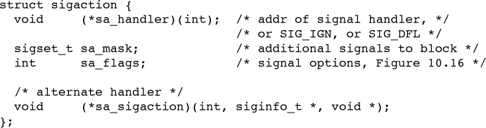
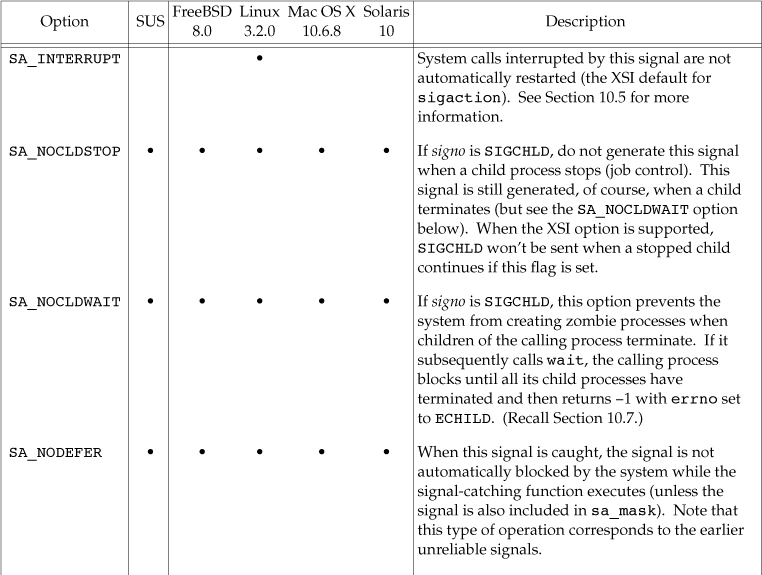
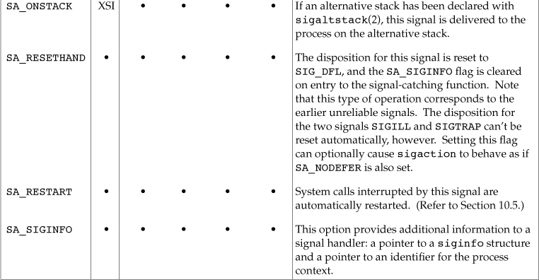
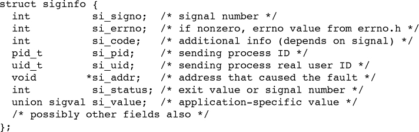

## Signal ##

### signals ###
* **SIGINT** This signal(**Control-C**) is sent to all processes in the foreground process group
* **SIGTSTP** This interactive stop signal is generated by the terminal driver when we press the terminal suspend key (**Control-Z**). 
* **SIGSTOP** This job-control signal stops a process.  And **can not be caught or ignored.**
* **SIGKILL** This signal is one of the two that **can’t be caught or ignored**. It provides the system administrator with a sure way to kill any process.
* **SIGTERM** This is the termination signal sent by the kill(1) command by default.

### signal function ###
	#include <signal.h>    /* defined by ISO C */
	void (*signal(int signo, void (*func)(int)))(int);
	typedef void Sigfunc(int);
	Sigfunc *signal(int, Sigfunc *);

**return value**

The semantics of `signal` differ among implementations, we must use the `sigaction` function instead. 

### 10.4. Unreliable Signals
### 10.5. Interrupted System Calls
### 10.6. Reentrant Functions
### 10.7. SIGCLD Semantics
### 10.8. Reliable-Signal Terminology and Semantics
### 10.9. kill and raise Functions
### 10.10. alarm and pause Functions
### 10.11. Signal Sets
A data type to represent multiple signals. The number of different signals can exceed the number of bits in an integer, o in general we can’t use an integer to represent the set with one bit per signal. 

	#include <signal.h>
	int sigemptyset(sigset_t *set);
	int sigfillset(sigset_t *set);
	int sigaddset(sigset_t *set, int signo);
	int sigdelset(sigset_t *set, int signo);
			All four return: 0 if OK, –1 on error
	int sigismember(const sigset_t *set, int signo);
			Returns: 1 if true, 0 if false, –1 on error
	sigset_t /* define by POSIX.1 */ 

### 10.12. sigprocmask Function
The signal mask of a process is the set of signals currently blocked from delivery to that process. 
	#include <signal.h>
	int sigprocmask(int how, const sigset_t *restrictset,sigset_t *restrict oset);
			Returns: 0 if OK, –1 on error

*  If oset is a non-null pointer, the current signal mask for the process is returned through oset.
*  If set is a non-null pointer, the how argument indicates how the current signal mask is modified.
*  If set is a null pointer, the signal mask of the process is not changed, and how is ignored.

### 10.13. sigpending Function
The sigpending function returns the set of signals that are blocked from delivery and currently pending for the calling process. 

	#include <signal.h>
	int sigpending(sigset_t *set);
			Returns: 0 if OK, –1 on error

### 10.14. sigaction Function
The sigaction function allows us to examine or modify (or both) the action associated with a particular signal.This function supersedes the `signal` function.

	#include <signal.h>
	int sigaction(int signo, const struct sigaction *restrict act,struct sigaction *restrict oact);

* If the act pointer is non-null, we are modifying the action. 
* If the oact pointer is non-null, the system returns the previous action for the signal through the oact pointer.
* Once we install an action for a given signal, that action remains installed until we explicitly change it by calling sigaction. 

The sa_sigaction field is an alternative signal handler used when the SA_SIGINFO flag is used with sigaction.

### 10.15. sigsetjmp and siglongjmp Functions
### 10.16. sigsuspend Function
### 10.17. abort Function
### 10.18. system Function
### 10.19. sleep, nanosleep, and clock_nanosleep Functions
### 10.20. sigqueue Function
### 10.21. Job-Control Signals
### 10.22. Signal Names and Numbers
### 10.23. Summary
