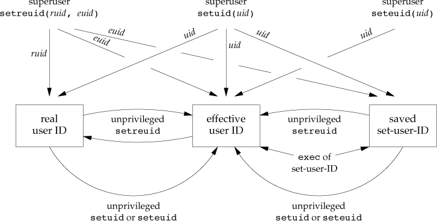

## Process Control ##

### Process Identifiers ###
**Process ID 0** is usually the scheduler process.
**Process ID 1** is usually the init process. The program file for this process was /etc/init in older versions of the UNIX System and is /sbin/init in newer versions. This process is responsible for bringing up a UNIX system after the kernel has been bootstrapped. **The init process never dies**. It is a **normal user process**, not a system process within the kernel.

	#include <unistd.h>
	pid_t getpid(void); 
	pid_t getppid(void);
	uid_t getuid(void);
	uid_t geteuid(void); # Returns: effective user ID of calling process
	gid_t getgid(void);
	gid_t getegid(void); # Returns: effective group ID of calling process

### fork Function ###
	#include <unistd.h>
	pid_t fork(void); # Returns: 0 in child, process ID of child in parent, –1 on error

One characteristic of fork is that all file descriptors that are open in the parent are duplicated in the child. . The parent and the child share a file table entry for every open descriptor, thus the parent and the child **share the same file offset**. 

There are two normal cases for handling the descriptors after a fork.

1. **The parent waits for the child to complete**. In this case, the parent does not need to do anything with its descriptors. When the child terminates, any of the shared descriptors that the child read from or wrote to will have their file offsets updated accordingly.
2. **Both the parent and the child go their own ways**. Here, after the fork, the parent closes the descriptors that it doesn’t need, and the child does the same thing. This way, neither interferes with the other’s open descriptors. This scenario is often found with network servers.

There are two uses for fork:

1. **When a process wants to duplicate itself so that the parent and the child can each execute different sections of code at the same time.** This is common for **network servers**—the parent waits for a service request from a client. When the request arrives, the parent calls fork and lets the child handle the request. The parent goes back to waiting for the next service request to arrive.
2. **When a process wants to execute a different program.** This is common for **shells**. In this case, the child does an exec right after it returns from the fork.

### vfork Function ###
The function vfork has the same calling sequence and same return values as fork, but the semantics of the two functions differ.

* The vfork function creates the new process, just like fork, without copying the address space of the parent into the child, as the child won’t reference that address space; the child simply calls exec (or exit) right after the vfork.Instead, the child runs in the address space of the parent until it calls either exec or exit.

* Another difference between the two functions is that vfork guarantees that the child runs first, until the child calls exec or exit. When the child calls either of these functions, the parent resumes.(This can lead to deadlock if the child depends on further actions of the parent before calling either of these two functions.)

### wait and waitpid Functions ###

A process that calls wait or waitpid can

* Block, if all of its children are still running.
* Return immediately with the termination status of a child, if a child has terminated and is waiting for its termination status to be fetched.
* Return immediately with an error, if it doesn’t have any child processes.

The defination is
  
	#include <sys/wait.h>	/* POSIX.1 */
	pid_t wait(int *statloc);
	pid_t waitpid(pid_t pid, int *statloc, int options);

If the `statloc`(status location) is not NULL, the return status of child process is saved here.
The interpretation of the pid argument for waitpid depends on its value:
>* **pid == –1** Waits for any child process. In this respect, waitpid is equivalent to wait.
>* **pid > 0** Waits for the child whose process ID equals pid.
>* **pid == 0** Waits for any child whose process group ID equals that of the calling process.
>* **pid < –1** Waits for any child whose process group ID equals the absolute value of pid.

The waitpid function provides three features that aren’t provided by the wait function.

1. The waitpid function lets us wait for one particular process, whereas the wait function returns the status of any terminated child. We’ll return to this feature when we discuss the popen function.
2. The waitpid function provides a nonblocking version of wait. There are times when we want to fetch a child’s status, but we don’t want to block.
3. The waitpid function provides support for job control with the WUNTRACED and WCONTINUED options.

### waitid Function ###
The waitid function is similar to waitpid, but provides extra flexibility.

	#include <sys/wait.h>
	int waitid(idtype_t idtype, id_t id, siginfo_t *infop, int options);

### wait3 and wait4 Functions ###
    #include <sys/types.h>
    #include <sys/wait.h>
    #include <sys/time.h>
    #include <sys/resource.h> 
    pid_t wait3(int *statloc, int options, struct rusage *rusage);
	pid_t wait4(pid_t pid, int *statloc, int options, struct rusage *rusage);

The resource information includes such statistics as the amount of **user CPU time**, amount of **system CPU time**, number of **page faults**, number of **signals received**, and the like. Refer to the getrusage(2) manual page for additional details. 

### Race Condition ###
Sometimes we want process coorperate to accomplish a job. But the order and executation time of process is can not predicted. Using `TELL` and `WAIT` functions to arrange the order of execuation.

### exec Functions ###

	#include <unistd.h>
    int execl(const char *pathname, const char *arg0, ... /* (char *)0 */ );
    int execv(const char *pathname, char *const argv []);
    int execle(const char *pathname, const char *arg0, .../* (char *)0, char *const envp[] */ );
    int execve(const char *pathname, char *const argv[], char *const envp[]);
    int execlp(const char *filename, const char *arg0, ... /* (char *)0 */ );
    int execvp(const char *filename, char *const argv[]);
    int fexecve(int fd, char *const argv[], char *const envp[]);
    /* All seven return: –1 on error, no return on success */

When a filename argument is specified,

* If filename contains a slash, it is taken as a pathname.
* Otherwise, the executable file is searched for in the directories specified by the PATH environment variable.

### Changing User IDs and Group IDs ###
**uid, effective uid, real uid** 
Note that we can obtain only the current value of the real user ID and the effective user ID with the functions `getuid` and `geteuid`. We have **no portable way** to obtain the current value of the saved set-user-ID.

	#include <unistd.h>
	int setuid(uid_t uid);
	int setgid(gid_t gid);
	int setreuid(uid_t ruid, uid_t euid); /* swapping of the real user ID and the effective user ID */
	int setregid(gid_t rgid, gid_t egid); /* swapping of the real group ID and the effective group ID */
	int seteuid(uid_t uid); /* only the effective user ID or effective group ID is changed */
	int setegid(gid_t gid);

* If the process **has** superuser privileges, the setuid function sets the **real user ID**, **effective user ID**, and **saved set-user-ID** to `uid`.
* If the process **does not have** superuser privileges, but uid equals either the real user ID or the saved set-user-ID, setuid sets only the effective user ID to uid. The real user ID and the saved set-user-ID are not changed.
* If **neither** of these two conditions is true, errno is set to EPERM and –1 is returned.

### Interpreter Files ###
	#! pathname [ optional-argument ]
	#!/bin/sh

### system Function ###
	#include <stdlib.h>
	int system(const char *cmdstring);

For example, `system("date > file");`, like in the shell.

###  Process Accounting ###

### User Identification ###
	#include <unistd.h>
	char *getlogin(void);
	/* Returns: pointer to string giving login name if OK, NULL on error */
### Process Scheduling ###