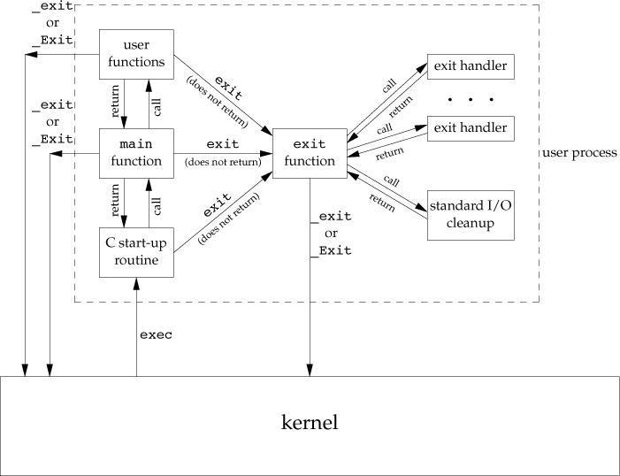
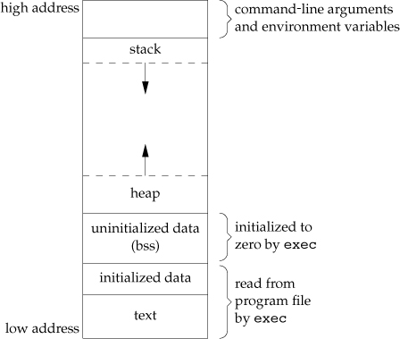
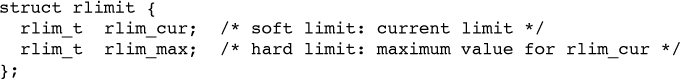
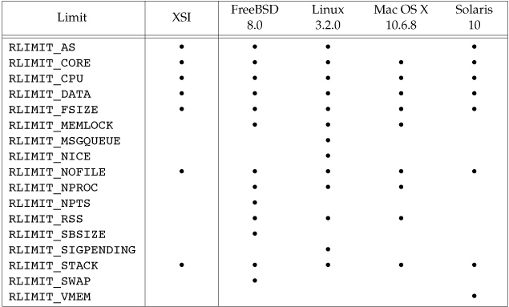

## Process Environment ##

### main Function ###

### Process termination ###
**Normal termination occurs in five ways:**

1. Return from main
2. Calling exit
3. Calling _exit or _Exit
4. Return of the last thread from its start routine
5. Calling pthread_exit from the last thread
 
**Abnormal termination occurs in three ways:**

6. Calling abort
7. Receipt of a signal
8. Response of the last thread to a cancellation request 

**Exit Functions**

	#include <stdlib.h>     # ISO C
	void exit(int status);  # performs certain cleanup processing and then returns to the kernel.
	void _Exit(int status); # return to the kernel immediately
	#include <unistd.h>     # POSIX
	void _exit(int status); # return to the kernel immediately

With ISO C, a process can register at least 32 functions that are automatically called by exit.These are called **exit handlers** and are registered by calling the **atexit function**.

	#include <stdlib.h>     # ISO C
	int atexit(void (*func)(void));

The following figure shows how a C program is started and how it terminates.

### Environment list ###
**Environment list** is an array of character pointers, `extern char **environ` is a global variable, a pointer to the array of character pointers. It can illustrated as:

Access to specific environment variables is normally through the getenv and putenv functions, instead of through the environ variable. But to go through the entire environment, the environ pointer must be used.

### Memory layout of a C program ###
A c program is composed of the following pieces:

* Text segment, consisting of the machine instructions that the CPU executes. 
* Initialized data segment, the C declaration `int   maxcount = 99;` appearing outside any function causes this variable to be stored in the initialized data segment with its initial value.
* Unitialized data segment, data in this segment is initialized by the kernel to arithmetic 0 or null pointers before the program starts executing. The C declaration `long   sum[1000];` appearing outside any function causes this variable to be stored in the uninitialized data segment.
* Stack
* Heap
* 

>Several more segment types exist in an a.out, containing **the symbol table**, **debugging information**, **linkage tables** for dynamic shared libraries, and the like. These additional sections don’t get loaded as part of the program’s image executed by a process.

### setjmp and longjmp Functions ###
	#include <setjmp.h>
	int setjmp(jmp_buf env);	# Returns: 0 if called directly, nonzero if returning from a call to longjmp
	void longjmp(jmp_buf env, int val);

The `setjmp` function save execution environment for longjmp to roll back. Mostly, the **automatic**, **register** are't rolled back, and the values of them are `it depends`. Global(extern, malloc) and static variable are rolled back.
The **volatile variables** are not optimized by compiler, **because it can be modified by other thread**, can be rolled back. While the **automatic**, **register** is(may be) optimized to register. 

### getrlimit and setrlimit Functions ###
	#include <sys/resource.h>
	int getrlimit(int resource, struct rlimit *rlptr);  # Both return: 0 if OK, –1 on error
	int setrlimit(int resource, const struct rlimit *rlptr); # Both return: 0 if OK, –1 on error

Three rules govern the changing of the resource limits.

1. A process can change its soft limit to a value less than or equal to its hard limit.
2. A process can lower its hard limit to a value greater than or equal to its soft limit. This lowering of the hard limit is irreversible for normal users.
3. Only a superuser process can raise a hard limit.

The resource argument takes one of the following values.

* **RLIMIT_AS** The maximum size in bytes of a process’s total available memory. This affects the sbrk function and the mmap function.
* **RLIMIT_CORE** The maximum size in bytes of a core file. A limit of 0 prevents the creation of a core file.
* **RLIMIT_CPU** The maximum amount of CPU time in seconds. When the soft limit is exceeded, the SIGXCPU signal is sent to the process.
* **RLIMIT_DATA** The maximum size in bytes of the data segment: the sum of the initialized data, uninitialized data, and heap from Figure 7.6.
* **RLIMIT_FSIZE** The maximum size in bytes of a file that may be created. When the soft limit is exceeded, the process is sent the SIGXFSZ signal.
* **RLIMIT_MEMLOCK** The maximum amount of memory in bytes that a process can lock into memory using mlock(2).
* **RLIMIT_MSGQUEUE** The maximum amount of memory in bytes that a process can allocate for POSIX message queues.
* **RLIMIT_NICE** The limit to which a process’s nice value can be raised to affect its scheduling priority.
* **RLIMIT_NOFILE**  The maximum number of open files per process. Changing this limit affects the value returned by the sysconf function for its _SC_OPEN_MAX argument.
* **RLIMIT_NPROC**  The maximum number of child processes per real user ID. Changing this limit affects the value returned for _SC_CHILD_MAX by the sysconf function
* **RLIMIT_NPTS** The maximum number of pseudo terminals that a user can have open at one time.
* **RLIMIT_RSS**  Maximum resident set size (RSS) in bytes. If available physical memory is low, the kernel takes memory from processes that exceed their RSS.
>In computing, resident set size is the portion of a process's memory that is held in RAM. The rest of the memory exists in swap or the filesystem (never loaded or previously unloaded parts of the executable).

* **RLIMIT_SBSIZE**  The maximum size in bytes of socket buffers that a user can consume at any given time.
* **RLIMIT_SIGPENDING** The maximum number of signals that can be queued for a process. This limit is enforced by the sigqueue function .
* **RLIMIT_STACK** The maximum size in bytes of the stack. 
* **RLIMIT_SWAP** The maximum amount of swap space in bytes that a user can consume.
* **RLIMIT_VMEM** This is a synonym for RLIMIT_AS.

**ISO C string-creation operator (#)** 

The `#name` represent string `"name"`.